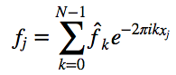
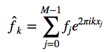

# nfft package

[](https://travis-ci.org/jakevdp/nfft/)[](https://pypi.python.org/pypi/nfft)
[](https://github.com/jakevdp/nfft/blob/master/LICENSE)

The ``nfft`` package is a lightweight implementation of the non-equispaced
fast Fourier transform (NFFT), implemented via numpy and scipy and released
under the MIT license.
For information about the NFFT algorithm, see the paper
[*Using NFFT 3 – a software library for various nonequispaced fast Fourier transforms*](http://dl.acm.org/citation.cfm?id=1555388).

The ``nfft`` package achieves comparable performance to the C package
described in that paper, without any customized compiled code. Rather, it
makes use of the computational building blocks available in NumPy and SciPy.
For a discussion of the algorithm and this implementation, see the
[Implementation Walkthrough](notebooks/ImplementationWalkthrough.ipynb)
notebook.


## About

The ``nfft`` package implements one-dimensional versions of the forward and
adjoint non-equispaced fast Fourier transforms;

The forward transform:



And the adjoint transform:



In both cases, the wavenumbers *k* are on a regular grid from -N/2 to N/2,
while the data values *x_j* are irregularly spaced between -1/2 and 1/2.

The direct and fast version of these algorithms are implemented in the following
functions:

- ``nfft.ndft``: direct forward non-equispaced Fourier transform
- ``nfft.nfft``: fast forward non-equispaced Fourier transform
- ``nfft.ndft_adjoint``: direct adjoint non-equispaced Fourier transform
- ``nfft.nfft_adjoint``: fast adjoint non-equispaced Fourier transform

### Computational complexity

The direct version of each transform has a computational complexity of
approximately *O[NM]*, while the NFFT has a computational complexity of
approximately *O[N log(N) + M log(1/ϵ)]*, where *ϵ* is the desired precision
of the result. In the current implementation, memory requirements scale as
approximately  *O[N + M log(1/ϵ)]*.

### Comparison to pynfft

Another option for computing the NFFT in Python is to use the
[pynfft](https://github.com/ghisvail/pyNFFT/) package, which provides a
Python wrapper to the C library referenced in the above paper.
The advantage of ``pynfft`` is that, compared to ``nfft``, it provides a more
complete set of routines, including multi-dimensional NFFTs, several related
extensions, and a range of computing strategies.

The disadvantage is that ``pynfft`` is GPL-licensed (and thus can't be used
in much of the more permissively licensed Python scientific world), and has
a much more complicated set of dependencies.

Performance-wise, ``nfft`` and ``pynfft`` are comparable, with the
implementation within ``nfft`` package being up to a factor of 2 faster
in most cases of interest (see [Benchmarks.ipynb](notebooks/Benchmarks.ipynb)
for some simple benchmarks).

If you're curious about the implementation and how ``nfft`` attains such
performance without a custom compiled extension, see the [Implementation
Walkthrough](notebooks/ImplementationWalkthrough.ipynb) notebook.

### Basic Usage

```python
import numpy as np
from nfft import nfft

# define evaluation points
x = -0.5 + np.random.rand(1000)

# define Fourier coefficients
N = 10000
k = - N // 2 + np.arange(N)
f_k = np.random.randn(N)

# non-equispaced fast Fourier transform
f = nfft(x, f_k)
```

For some more examples, see the notebooks in the [notebooks](notebooks)
directory.


## Installation

The ``nfft`` package can be installed directly from the Python Package Index:

```
$ pip install nfft
```

Dependencies are [numpy](http://www.numpy.org), [scipy](http://www.scipy.org),
and [pytest](http://www.pytest.org), and the package is tested in Python
versions 2.7. 3.5, and 3.6.


## Testing

Unit tests can be run using [pytest](http://pytest.org):

```
$ pytest --pyargs nfft
```


## License

This code is released under the [MIT License](LICENSE). For more information,
see the [Open Source Initiative](https://opensource.org/licenses/MIT)


## Support

Development of this package is supported by the
[UW eScience Institute](http://escience.washington.edu/),
with funding from
the [Gordon & Betty Moore Foundation](https://www.moore.org/),
the [Alfred P. Sloan Foundation](https://sloan.org/),
and the [Washington Research Foundation](http://www.wrfseattle.org/)